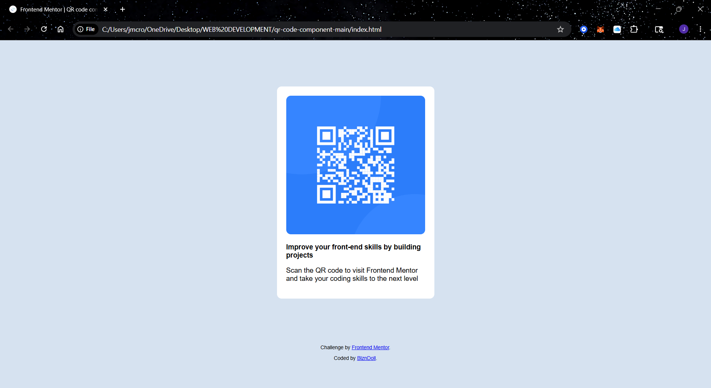

# Frontend Mentor - QR code component solution

This is a solution to the [QR code component challenge on Frontend Mentor](https://www.frontendmentor.io/challenges/qr-code-component-iux_sIO_H). Frontend Mentor challenges help you improve your coding skills by building realistic projects. 

## Table of contents

- [Overview](#overview)
  - [Screenshot](#screenshot)
  - [Links](#links)
- [My process](#my-process)
  - [Built with](#HTML)(#CSS)
  - [What I learned](#GitHub)
  - [Continued development](#freecodecamp.org)
- [Author](#BlznDoll)

## Overview

This is an overview of the QR code component solution project for Frontend Mentor. 

### Screenshot

### Links

- Solution URL: [https://github.com/BlznDoll/qr-code-project]
- Live Site URL: [http://localhost:5500/index.html]

## My process

Creating an html and css file. Linking stylesheets and links. Connecting files to GitHub with the terminal in VS code. 

### Built with

- Semantic HTML5 markup
- CSS custom properties
- Mobile-first workflow

### What I learned

I learned more about working with Git and GitHub while working on this project. Working with the terminal in VS code with Git.

### Continued development

I want to focus on CSS Grid, Flexbox, Git & GitHub, and JavaScript for continued development.

### Useful resources

- [freeCodeCamp](https://www.freecodecamp.org) - This has helped me learn and get hands on experience with learning Responsive Web Design. It is free to sign up. They offer so much information in development. I really liked this website and will use it going forward.

## Author

- Frontend Mentor - [@BlznDoll](https://www.frontendmentor.io/profile/yourusername)
- Twitter - [@ladyblzn](https://www.twitter.com/ladyblzn)
